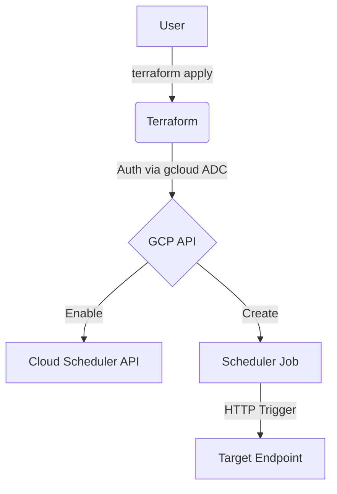
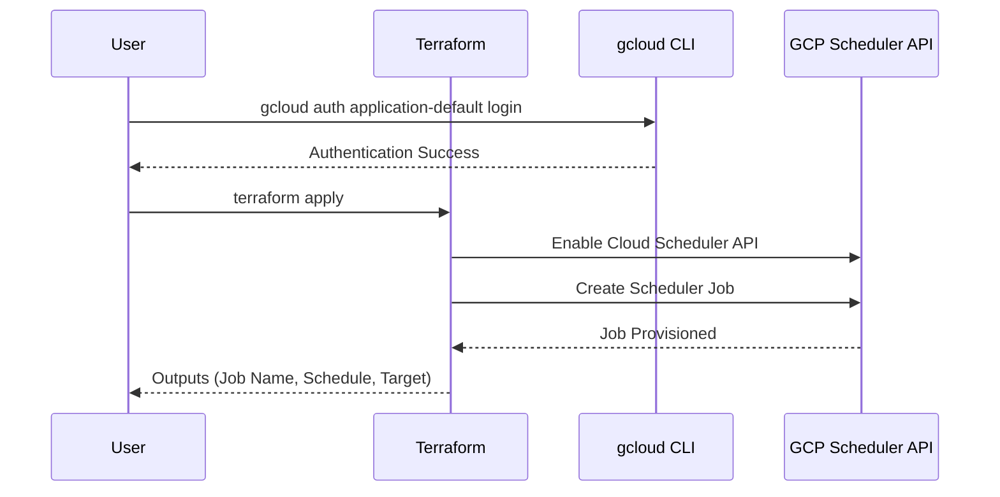

# terraform-gcp-cloud-scheduler

This Terraform project provisions a Google Cloud Scheduler job that triggers an HTTP endpoint on a cron schedule.

## Architecture

### Flowchart


### Sequence Diagram


## Specifications
- **Schedule**: Configurable cron expression (default every 3 hours).
- **Target**: HTTP/HTTPS endpoint with OIDC authentication support.
- **Time Zone**: Configurable (default UTC).

## Prerequisites
1.  **Google Cloud SDK**: [Installed and initialized](https://cloud.google.com/sdk/docs/install).
2.  **Terraform**: [Installed](https://developer.hashicorp.com/terraform/downloads).

## Setup & Deployment

1.  **Authenticate and Select Project**:
    ```bash
    gcloud auth application-default login
    gcloud config set project your-project-id
    ```

2.  **Configure Variables**:
    Create a `terraform.tfvars` file based on the example:
    ```hcl
    project_id  = "your-project-id"
    region      = "us-central1"
    job_name    = "my-scheduler-job"
    schedule    = "0 */3 * * *"
    target_uri  = "https://your-cloud-run-service-uc.a.run.app"
    ```

3.  **Deploy**:
    ```bash
    terraform init
    terraform apply
    ```

## Schedule Types & Cron Reference

Cloud Scheduler uses standard unix-cron format with 5 fields: `minute hour day-of-month month day-of-week`.

| Field | Range | Special Characters |
|-------|-------|-------------------|
| Minute | 0-59 | `, - * /` |
| Hour | 0-23 | `, - * /` |
| Day of Month | 1-31 | `, - * /` |
| Month | 1-12 or JAN-DEC | `, - * /` |
| Day of Week | 0-6 or SUN-SAT | `, - * /` |

### Common Schedule Examples

| Schedule | Expression | Description |
|----------|------------|-------------|
| Every minute | `* * * * *` | Runs every minute |
| Every 5 minutes | `*/5 * * * *` | Every 5 minutes |
| Every hour | `0 * * * *` | At the start of every hour |
| Every 3 hours | `0 */3 * * *` | Every 3 hours (default) |
| Every 6 hours | `0 */6 * * *` | Every 6 hours |
| Twice daily | `0 6,18 * * *` | At 6 AM and 6 PM daily |
| Daily at 8 AM | `0 8 * * *` | Every day at 8:00 |
| Daily at 8 AM UTC | `0 8 * * *` | Same, set time_zone to UTC |
| Every weekday 9 AM | `0 9 * * 1-5` | Mon-Fri at 9:00 |
| Every Monday 3 AM | `0 3 * * 1` | Only Mondays at 3:00 |
| Every 15 minutes | `*/15 * * * *` | Every 15 minutes |
| First day of month | `0 0 1 * *` | Midnight on the 1st |
| Every 30 seconds | (not supported) | Minimum interval is 1 minute |

### Using Time Zones

Set `time_zone` to your preferred timezone for the schedule to align with local time:

```hcl
schedule  = "0 9 * * *"     # 9 AM
time_zone = "America/New_York"  # Eastern Time
```

Common timezone values: `UTC`, `America/New_York`, `America/Chicago`, `America/Denver`, `America/Los_Angeles`, `Asia/Tokyo`, `Asia/Shanghai`, `Europe/London`, `Europe/Berlin`, `Australia/Sydney`.

### Special Schedules via App Engine (uncommon)

Cloud Scheduler also supports App Engine HTTP targets and Pub/Sub targets. This module focuses on HTTP targets — the most common use case for triggering containerized apps and APIs.

### Frequency Limits

- Minimum interval: **1 minute** (cron does not support seconds-level granularity).
- Maximum frequency is limited by your GCP project quota (typically 300 jobs per project).

## Usage as a Module

> **Option 1**: Terraform Registry (recommended)
> ```hcl
> module "cloud-scheduler" {
>   source  = "marcuwynu23/cloud-scheduler/gcp"
>   version = "1.0.0"
>
>   project_id   = var.project_id
>   region       = "us-central1"
>   job_name     = "daily-cron"
>   schedule     = "0 6 * * *"
>   target_uri   = "https://my-api-uc.a.run.app/trigger"
>   http_method  = "POST"
> }
> ```
>
> **Option 2**: GitHub source
> ```hcl
> module "cloud-scheduler" {
>   source = "github.com/marcuwynu23/terraform-gcp-cloud-scheduler?ref=main"
>
>   project_id   = var.project_id
>   region       = "us-central1"
>   job_name     = "daily-cron"
>   schedule     = "0 6 * * *"
>   target_uri   = "https://my-api-uc.a.run.app/trigger"
>   http_method  = "POST"
> }
> ```

## Variables

| Variable | Description | Type | Default |
|----------|-------------|------|---------|
| `project_id` | GCP project ID | `string` | (required) |
| `region` | GCP region (free tier: us-west1, us-central1, us-east1) | `string` | `"us-central1"` |
| `job_name` | Scheduler job name | `string` | `"my-scheduler-job"` |
| `job_description` | Job description | `string` | `"Triggers a Cloud Run service periodically"` |
| `schedule` | Cron schedule expression | `string` | `"0 */3 * * *"` |
| `time_zone` | Schedule time zone | `string` | `"UTC"` |
| `attempt_deadline` | Execution attempt deadline | `string` | `"180s"` |
| `http_method` | HTTP method for the target | `string` | `"POST"` |
| `target_uri` | Target endpoint URI | `string` | (required) |
| `body` | Request body | `string` | `"{}"` |
| `headers` | Request headers | `map(string)` | `{Content-Type = "application/json"}` |
| `oidc_sa_email` | OIDC service account email | `string` | `""` |
| `oidc_audience` | OIDC audience | `string` | `""` |

## Outputs

| Output | Description |
|--------|-------------|
| `job_name` | The name of the Cloud Scheduler job |
| `job_schedule` | The cron schedule of the job |
| `job_target_uri` | The target URI of the job |
